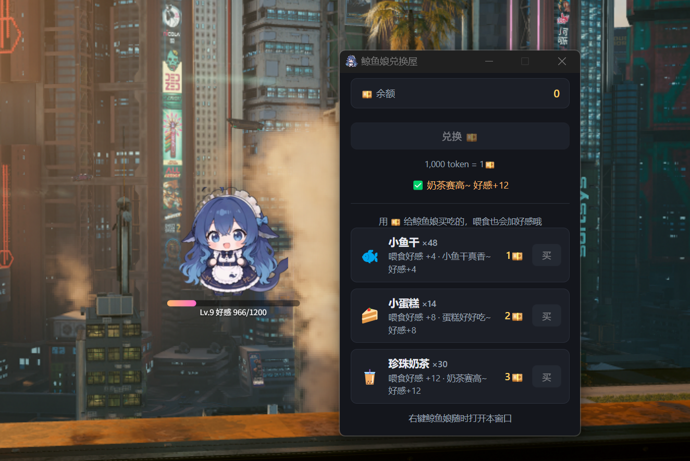
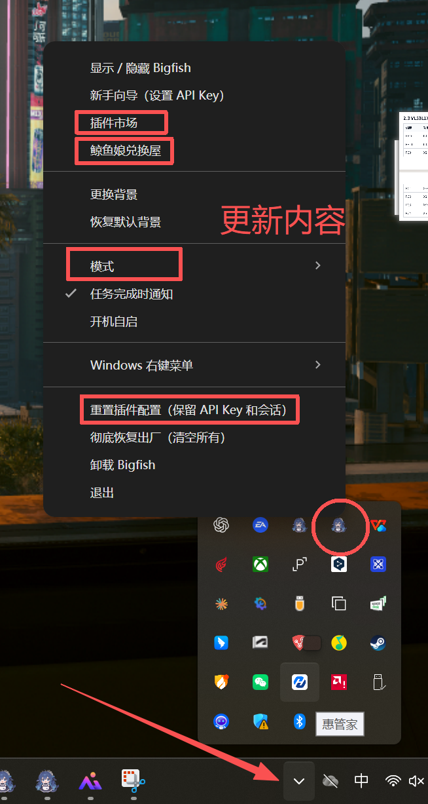
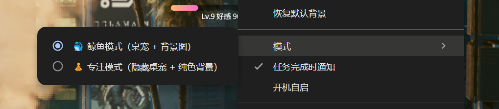

<div align="center">

# Bigfish 🐳

**DeepSeek Harness 的 Electron 桌面版 —— 把 `dsh web` 包进原生桌面窗口。**

免去手动开终端、记端口、开浏览器。装完双击即用。

[下载安装包](https://github.com/ludonghuai/big-fish/releases) · [版本说明](版本说明.txt) · [使用说明](使用说明.txt) · [已知问题与排查](已知问题与排查.md) · [致谢与合规](THIRD-PARTY-NOTICES.md)

</div>


Bigfish 是 [DeepSeek Harness](https://github.com/deepseek-ai/deepseek-harness) 的 Electron 桌面版。

把 `dsh web` 的本地后端 + React UI 包进一个原生桌面窗口，免去手动开终端、记端口、开浏览器。

> **当前版本：`0.0.1`** · 已发布 Windows 安装包；macOS / Linux 目前需自行打包（见下文「打包」）
>
> **源码、文档与问题反馈**：<https://gitee.com/ludonghuai/big-fish>

## 下载与安装

| 平台 | 文件 | 说明 |
| --- | --- | --- |
| Windows 10 / 11 | [`Bigfish.Setup.0.0.1.exe`](https://github.com/ludonghuai/big-fish/releases/download/v0.0.1/Bigfish.Setup.0.0.1.exe) | 约 206 MB，双击按向导安装 |

安装包没有做代码签名：Windows 若弹「Windows 已保护你的电脑」，点「更多信息 → 仍要运行」
（不是病毒，是没买签名证书）。

> 为什么下载不在 Gitee：Gitee 发行版的单个附件上限是 100 MB，而安装包约 206 MB（自带 Node.js
> 运行时与后端依赖），传不上去，所以安装包托管在 GitHub Releases；Gitee 这边放源码、文档与更新清单。
> GitHub 在国内部分网络下访问不稳定，若打不开可换网络或使用加速工具。

## 功能亮点

- **一体化安装包**：自带 Node.js 运行时与 dsh 后端，装完双击即用，无需手动配置环境
- **预装技能**：图片识别 / PPT 生成 / 文档总结 / 写作助手 / 翻译（面向普通用户）
- **插件市场**：托盘菜单 →「插件市场」，连接社区最大插件平台
  （awesome-dsh-plugin，1000+ 插件），支持搜索/分类、一键安装/卸载，安装后自动重启生效
- **桌面萌宠（鲸鱼娘）**：透明悬浮窗，可拖动、点击互动、随机散步/睡觉/说话，
  好感度与兑换屋玩法，动画素材持续更新中
- **系统托盘 + 全局快捷键**（Ctrl+Shift+D 唤起）
- **任务完成提醒**：任务跑完气泡 + 系统通知
- **模型设置**：主界面「设置 ▸ 模型」内置 API Key 引导（注册 / 充值步骤见 使用说明.txt）
- **故障自助**：后端启动失败时引导「重置插件配置（保留 API Key/会话）」「彻底恢复出厂」
- 背景图（深/浅色适配 + 自定义背景）、开机自启、Windows 右键「用 Bigfish 打开」

## 截图

| 鲸鱼娘桌宠 + 兑换屋 | 托盘菜单（插件市场 / 兑换屋 / 模式 / 重置） |
| --- | --- |
|  |  |

| 专注模式 / 鲸鱼模式 |
| --- |
|  |

## 工作原理

```
┌─────────────────────────────────────────┐
│  Electron 主进程 (main.js)               │
│   1. 找一个空闲的 127.0.0.1 端口         │
│   2. 拉起 dsh --profile web 子进程        │
│   3. 轮询直到后端就绪                     │
│   4. BrowserWindow 加载 http://127.0.0.1:端口 │
│   5. 插件市场：内置 pnpm 管理 profile 插件 │
└─────────────────────────────────────────┘
```

后端复用的是 `@deepseek-ai/dsh` 这个 npm 包，与命令行版完全一致；桌面版只是给它套了一层原生窗口。后端本身只监听 `127.0.0.1`（CLI 源码禁止 `0.0.0.0`，安全边界现成）。

## 开发运行

```bash
git clone https://gitee.com/ludonghuai/big-fish.git
cd big-fish
npm install
npm start
```

> 需要 Node.js >= 22。`npm install` 会自动把后端依赖（`dsh-bundle/`）一并装好；即使漏了，
> `npm start` 启动前也会自检补齐（`scripts/ensure-deps.js`），不用再单独进 `dsh-bundle` 装一次。
> 国内网络建议先 `npm config set registry https://registry.npmmirror.com/`。
> 详细排查见 [已知问题与排查](已知问题与排查.md)。

> 仓库**不提交 `node_modules`**：两处依赖合计约 750 MB / 4.3 万个文件，且 electron、koffi、
> node-pty 都是平台专有二进制（Windows 上装好的那份拿到 macOS / Linux 直接不可用）。
> 打包需要的内置 Node 与 pnpm 放在 `node-runtime/`（同样不入库，见下方「打包」）。

## 打包

```bash
npm run dist:win      # Windows NSIS 安装包
npm run dist:mac      # macOS dmg（需在 macOS 上构建）
npm run dist:linux    # Linux AppImage + deb（需在 Linux 上构建）
```

产物输出到 `dist/`。

> 注意：原生依赖（node-pty / sharp / koffi 等）需在各自目标平台上构建；跨平台产物请用对应平台的 CI 或机器打包。仓库里的 GitHub Actions 工作流（`.github/workflows/build.yml`）是按 tag 触发三平台构建的模板，迁到 Gitee 后需换成 Gitee Go 或本地打包。

## 运行时选择

| 场景 | 执行 dsh 的运行时 |
|---|---|
| 开发 (`npm start`) | 系统 Node（`DSH_NODE` 环境变量可覆盖） |
| 打包后 | 自带 Node（`node-runtime/`），无需系统 Node |

## 插件系统

Bigfish 遵循 DeepSeek Harness 官方 Cordis 插件体系：

- 插件 = npm 包（声明 `dsh.bundle.patch` + `dsh.client`），安装进 `~/.dsh/profiles/web`，
  重启后生效；装好后插件的设置页会自动出现在 DSH 客户端的「设置」里
- 安装引擎：应用内置独立 pnpm（`node-runtime/pnpm/pnpm.mjs`），无需用户装任何东西
- 市场目录：在线实时取 awesome-dsh-plugin 全量目录，失败回退内置精选副本 `plugins.json`
- 内置离线插件：`bundled-plugins/`（可放随软件内置、无需联网安装的插件）

## 目录

- `main.js` — Electron 主进程组合根：常量、userData 覆盖、单实例锁、启动引导、退出钩子、模块接线
- `shell-*.js` — 主进程 15 个域模块（设置 / 资产 / 通知 / 后端 / 桌宠（几何 · 拖动 · 本体）/ 兑换屋 / 模式背景 / 插件 / 主窗口 / 市场 / 托盘 / 更新 / IPC 注册）
- `market.html / market.js / market-preload.js` — 插件市场窗口
- `exchange.html / exchange.js / exchange-preload.js` — 兑换屋窗口
- `plugins.json` — 插件市场内置精选目录（离线兜底）
- `bundled-plugins/` — 随软件内置的插件（离线安装）
- `bundled-skills/` — 随软件预装的技能提示词
- `pet.html / pet.js / pet-preload.js` — 桌宠透明悬浮窗
- `assets/pet-new/` — 桌宠动画素材（分帧目录，持续更新）
- `node-runtime/pnpm/` — 内置 pnpm（插件安装引擎）
- `package.json` — 依赖与 electron-builder 打包配置

## 文档

| 文档 | 面向 | 内容 |
| --- | --- | --- |
| [使用说明](使用说明.txt) | 普通用户 | 下载、安装、首次使用、插件市场怎么用 |
| [版本说明](版本说明.txt) | 普通用户 | 当前版本新增了什么、安装包清单 |
| [已知问题与排查](已知问题与排查.md) | 用户 + 开发者 | 启动失败、杀毒拦截、本地运行等故障自助 |
| [致谢与合规](THIRD-PARTY-NOTICES.md) | 所有人 | 第三方组件来源与许可证 |
| [docs/](docs/README.md) | 开发者 | 需求档 / 设计档 / 批次档（桌宠等板块） |

## 反馈

问题、建议、需求都可以提在 Gitee 仓库的 Issues 里：<https://gitee.com/ludonghuai/big-fish>

提 Issue 时附上系统版本、Bigfish 版本号，以及 `%USERPROFILE%\.dsh` 下的报错日志会更快定位。

## 致谢与合规

- 桌宠插件化方案参考自第三方社区项目
  [s17179XTY/dsh-BigfishPet](https://github.com/s17179XTY/dsh-BigfishPet)
  —— 该项目由 **s17179XTY**（非 Bigfish Team）fork 本仓库改造而成，
  作者 GitHub：[s17179XTY](https://github.com/s17179XTY)，MIT 协议，
  详见 [THIRD-PARTY-NOTICES.md](THIRD-PARTY-NOTICES.md)
- 插件市场在线目录来自 [awesome-dsh-plugin](https://awesome-dsh-plugin.com) 社区
- 桌宠视频动画素材与动画链机制参考自 [PC2005-cloud/dsh-pet](https://github.com/PC2005-cloud/dsh-pet)
  （作者 **PC2005-cloud**；素材许可 = 允许开源使用、**禁止商用**，本仓非商用 ⇒ 可用；
  转商用须先替换为自产素材或取得原作者授权）——详见 [THIRD-PARTY-NOTICES.md](THIRD-PARTY-NOTICES.md)
- DeepSeek Harness 本体：[deepseek-ai/deepseek-harness](https://github.com/deepseek-ai/deepseek-harness)（MIT）
- 详见 [THIRD-PARTY-NOTICES.md](THIRD-PARTY-NOTICES.md)
